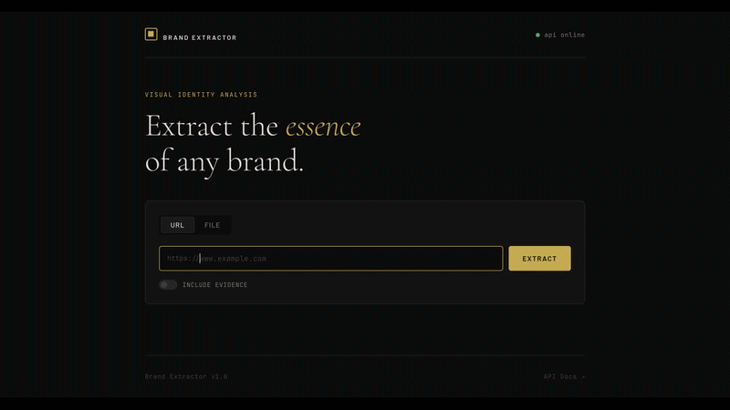

# AI Brand Extractor Service

> Multimodal brand intelligence platform. Give it a URL or upload a flyer — get back a structured brand profile: name, tagline, colours, logo, social links and confidence scores.

[](https://github.com/Cash-Codes/AI_brand_extractor/actions/workflows/ci.yml)


[](#)
[](#)
[](#)


---

## 🎥 Demo



## ✨ Features

- **Deterministic-first, AI-as-selector** — rule-based services rank every signal (CSS tokens, OG tags, DOM order) before Gemini sees anything; AI selects from real evidence, never hallucinates
- **Schema-constrained Gemini output** — Vertex AI controlled generation forces a strict JSON schema; no markdown fences, no missing fields, no invented values
- **Multimodal OCR + visual analysis** — Gemini multimodal extracts text with bounding boxes and dominant visual theme from uploaded images
- **CSS Color Level 4 support** — extracts brand colours from `:root {}` design tokens including Tailwind's space-separated `rgb()` syntax, frequency-ranked
- **Confidence scores on every field** — downstream systems know exactly how much to trust each extracted value

## 🧠 Tech Stack

| Layer | Technology |
|---|---|
| Language | Java 21 (records, sealed interfaces, pattern matching) |
| Framework | Spring Boot 3.4.4 |
| AI | Vertex AI Gemini 2.x (multimodal, structured generation) |
| HTML parsing | Jsoup 1.18 |
| DTO mapping | MapStruct 1.6 |
| Build | Gradle 8 (Groovy DSL) |
| Containerisation | Docker (multi-stage, JRE 21 slim) |
| Deployment | Google Cloud Run |
| CI/CD | GitHub Actions |
| Testing | JUnit 5, Mockito, Spring Boot Test, AssertJ |
| API docs | SpringDoc OpenAPI 3 (Swagger UI) |


## 🖼️ Screenshots


## API

### `POST /api/v1/extractions/url`

```json
// Request
{ "url": "https://www.cancerresearchuk.org/" }

// Query param (optional): ?include=evidence
```

```json
// Response 200
{
  "requestId": "a1b2c3d4-...",
  "inputType": "URL",
  "source": {
    "originalUrl": "https://www.cancerresearchuk.org/",
    "resolvedUrl": "https://www.cancerresearchuk.org/"
  },
  "brandProfile": {
    "brandName":   { "value": "Cancer Research UK", "confidence": 0.95 },
    "tagline":     { "value": "Together we will beat cancer", "confidence": 0.88 },
    "summary":     { "value": "...", "confidence": 0.82 },
    "toneKeywords": ["hopeful", "scientific", "trusted", "urgent", "compassionate"]
  },
  "colors": {
    "primary":   { "value": "#00007E", "confidence": 0.91 },
    "secondary": { "value": "#FF0087", "confidence": 0.85 },
    "text":      { "value": "#1A1A1A", "confidence": 0.78 }
  },
  "assets": {
    "logos": [
      { "url": "https://...cruk-logo.png", "role": "PRIMARY_LOGO", "confidence": 0.90 }
    ],
    "heroImages": []
  },
  "links": {
    "website":   "https://www.cancerresearchuk.org/",
    "twitter":   "https://twitter.com/CR_UK",
    "facebook":  "https://www.facebook.com/cancerresearchuk",
    "instagram": "https://www.instagram.com/cr_uk"
  },
  "confidence": { "overall": 0.89 },
  "warnings": [],
  "validationIssues": []
}
```

### `POST /api/v1/extractions/file`

Multipart form with:
- `file` — JPEG or PNG, max 10 MB
- `sourceLabel` — optional human label (e.g. `"acme-summer-poster.png"`)

Same response shape as the URL endpoint with `"inputType": "FILE"`.

### Error format

All errors use [RFC 9457 Problem Detail](https://www.rfc-editor.org/rfc/rfc9457):

```json
{
  "type": "/errors/validation",
  "title": "Validation failed",
  "status": 422,
  "detail": "URL must use http or https scheme",
  "instance": "/api/v1/extractions/url"
}
```

---

## Local setup

### Prerequisites

- Java 21
- For real AI: GCP project with Vertex AI API enabled + `gcloud auth application-default login`

### 1. Clone and configure

```bash
git clone https://github.com/Cash-Codes/AI_brand_extractor.git
cd AI_brand_extractor_service
cp .env.example .env    # edit VERTEXAI_PROJECT_ID to enable real AI
```

### 2. Run

```bash
make run          # compiles and starts Spring Boot, sourcing .env automatically
```

Open `http://localhost:8080` for the browser UI, or send requests to the API directly.

Swagger UI: `http://localhost:8080/swagger-ui.html`

**Without `VERTEXAI_PROJECT_ID`** the service starts in mock mode — all extraction calls return labelled stub data. No GCP account needed.

---

## Docker

```bash
make docker-build
make docker-run      # runs with --env-file .env
```

Or manually:

```bash
docker build -t brand-extractor-service .
docker run --env-file .env -p 8080:8080 brand-extractor-service
```

The Dockerfile uses a multi-stage build: Gradle build in a JDK 21 image, runtime in a slim JRE 21 image. The final image is ~180 MB.

---

## Testing

```bash
./gradlew test                           # full suite (357 tests)
./gradlew test --tests "*.ColorRanking*" # single class
```

Test coverage spans:
- **Unit tests** — every ranking service, the response parser, the OCR client, the ingestion adapters, the normaliser/validator
- **Integration tests** — full Spring Boot context with mocked AI client; tests verify that candidates discovered from fixture HTML are correctly passed to the AI layer
- **Pre-push hook** — the full test suite runs automatically before every `git push`

---

## Deployment (Cloud Run)

```bash
./deploy-cloudrun.sh
```

The script builds the Docker image, pushes it to Google Artifact Registry and deploys to Cloud Run. Cloud Run handles auto-scaling to zero and injects `$PORT` automatically (the service honours both `PORT` and `SERVER_PORT`).

Required GCP permissions: `run.services.create`, `artifactregistry.repositories.uploadArtifacts`, `aiplatform.endpoints.predict`.

Graceful shutdown is configured with a 15-second drain period.

---

## Environment variables

| Variable | Default | Description |
|---|---|---|
| `SPRING_PROFILES_ACTIVE` | `local` | `local` = mock AI; `dev`/`prod` = real Vertex AI |
| `VERTEXAI_ENABLED` | `false` | Must be `true` to call Gemini |
| `VERTEXAI_PROJECT_ID` | — | GCP project ID |
| `VERTEXAI_LOCATION` | `us-central1` | Vertex AI region |
| `VERTEXAI_MODEL_ID` | `gemini-2.0-flash-001` | Gemini model ID |
| `VERTEXAI_TEMPERATURE` | `0.0` | `0.0` = fully deterministic |
| `VERTEXAI_MAX_OUTPUT_TOKENS` | `4096` | Max JSON response length |
| `VERTEXAI_MAX_PARSE_RETRIES` | `2` | Retries on malformed JSON |
| `SERVER_PORT` | `8080` | HTTP listen port |
| `MAX_UPLOAD_SIZE` | `10MB` | Multipart file size limit |

Authentication uses [Application Default Credentials](https://cloud.google.com/docs/authentication/application-default-credentials). No key file required.

---

## Known limitations

- **Screenshot capture is a no-op.** `ScreenshotPort` is implemented but no headless browser client is wired. Visual analysis for URL extraction only runs when a screenshot is provided externally.
- **Tailwind / CSS-in-JS sites.** Colour extraction is best-effort. The `:root` design-token approach handles most modern frameworks but purged CSS can reduce candidate quality.
- **No rate limiting.** V1 has no per-IP rate limiting. Put an API gateway in front for production.
- **No persistence.** Results are not stored. Each call is stateless.
- **JPEG and PNG only.** WEBP, AVIF, GIF and PDF are not currently supported.

---

## Roadmap

- **Headless screenshot.** Playwright or Puppeteer sidecar for visual analysis on URL extractions.
- **Batch endpoint.** `POST /api/v1/extractions/batch` — process multiple URLs concurrently.
- **Result caching.** Redis-backed cache keyed on URL + content hash.
- **WEBP / PDF support.** Extend `MimeTypeUtils` and the ingestion adapters.
- **Per-IP rate limiting.** bucket4j or API gateway integration.
- **Async API.** `202 Accepted` + polling pattern for slow sites.
- **OpenTelemetry tracing.** Per-stage latency spans for production observability.

---