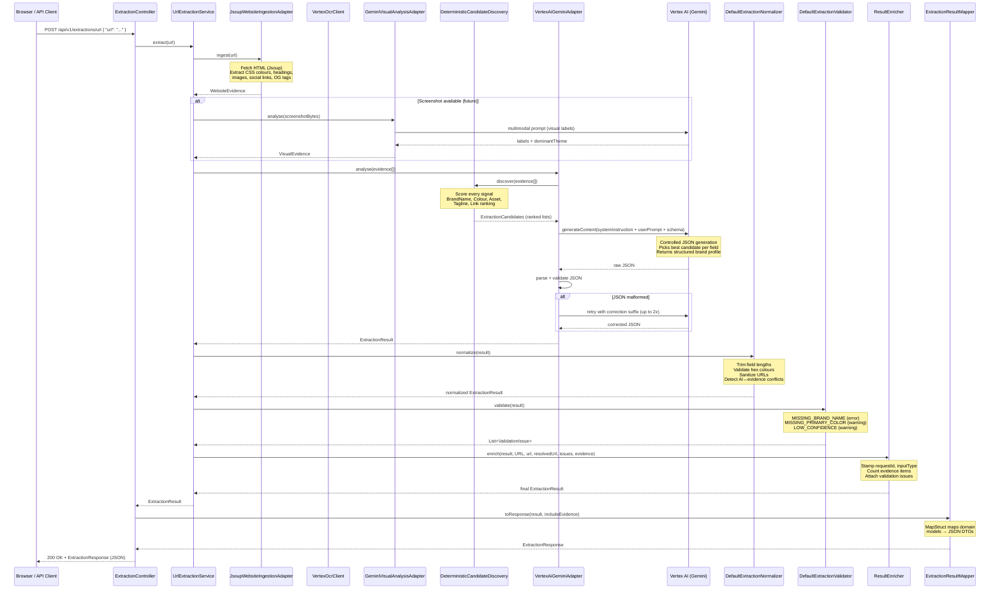

# AI Brand Extractor Service — Technical Guide

---

## Table of Contents

1. [What the app does](#1-what-the-app-does)
2. [Project structure](#2-project-structure)
3. [Full request flow (diagram)](#3-full-request-flow-diagram)
4. [The web layer — REST API](#4-the-web-layer--rest-api)
   - 4.1 [ExtractionController](#41-extractioncontroller)
   - 4.2 [Request and response DTOs](#42-request-and-response-dtos)
   - 4.3 [ExtractionResultMapper](#43-extractionresultmapper)
5. [The application layer — use cases](#5-the-application-layer--use-cases)
   - 5.1 [UrlExtractionService](#51-urlextractionservice)
   - 5.2 [FileExtractionService](#52-fileextractionservice)
   - 5.3 [ResultEnricher](#53-resultenricher)
6. [The domain layer — what "hexagonal architecture" means here](#6-the-domain-layer--what-hexagonal-architecture-means-here)
   - 6.1 [Port interfaces](#61-port-interfaces)
   - 6.2 [Domain models](#62-domain-models)
   - 6.3 [Evidence types](#63-evidence-types)
   - 6.4 [Candidate types](#64-candidate-types)
7. [Ingestion — how raw data becomes Evidence](#7-ingestion--how-raw-data-becomes-evidence)
   - 7.1 [JsoupWebsiteIngestionAdapter (URL)](#71-jsoupwebsiteingestionadapter-url)
   - 7.2 [CSS colour extraction deep dive](#72-css-colour-extraction-deep-dive)
   - 7.3 [MultipartFlyerIngestionAdapter (file)](#73-multipartflyeringestionadapter-file)
   - 7.4 [ImageColorSampler](#74-imagecolorsampler)
8. [OCR — reading text from images](#8-ocr--reading-text-from-images)
   - 8.1 [VertexOcrClient](#81-vertexocrclient)
   - 8.2 [OcrPortAdapter](#82-ocrportadapter)
9. [Visual analysis — understanding images](#9-visual-analysis--understanding-images)
10. [Deterministic candidate discovery](#10-deterministic-candidate-discovery)
    - 10.1 [DeterministicCandidateDiscoveryAdapter](#101-deterministiccandidatediscoveryadapter)
    - 10.2 [ColorRankingService](#102-colorrankingservice)
    - 10.3 [BrandNameRankingService](#103-brandnamerankingservice)
    - 10.4 [AssetRankingService](#104-assetrankingservice)
11. [AI integration — Vertex AI Gemini](#11-ai-integration--vertex-ai-gemini)
    - 11.1 [VertexAiGeminiAdapter](#111-vertexaigeminiadapter)
    - 11.2 [VertexAiPromptFactory](#112-vertexaipromptfactory)
    - 11.3 [VertexAiExtractionClient](#113-vertexaiextractionclient)
    - 11.4 [VertexAiResponseParser](#114-vertexairesponseparser)
    - 11.5 [MockBrandExtractionAiClient](#115-mockbrandextractionaiclient)
12. [Normalisation and validation](#12-normalisation-and-validation)
13. [Error handling](#13-error-handling)
14. [Configuration and profiles](#14-configuration-and-profiles)
15. [Testing strategy](#15-testing-strategy)
16. [Key design decisions](#16-key-design-decisions)

---

## 1. What the app does

You give it a brand. It gives you back everything you need to know about that brand's visual identity.

There are two ways to give it a brand:

- **A URL** — it visits the website, parses the HTML, extracts colours from the CSS, finds the logo, reads the social links and figures out the brand name from the page title and meta tags.
- **An image file** — it reads the pixel colours, runs OCR to extract the text and uses AI to understand what kind of brand the image represents.

After gathering all this raw data, a rule-based engine ranks every signal it found (e.g. "the OG title tag is a stronger brand name signal than a random h3 heading"). Then it sends those pre-ranked candidates to Google's Gemini AI model, which picks the best brand name, tagline, colours, logo and social links — and returns everything as structured JSON.

The final response looks like this:

```json
{
  "brandProfile": {
    "brandName":  { "value": "Acme Studio", "confidence": 0.95 },
    "tagline":    { "value": "Crafting brands that endure", "confidence": 0.88 }
  },
  "colors": {
    "primary":   { "value": "#1E3A8A", "confidence": 0.91 },
    "secondary": { "value": "#FF6600", "confidence": 0.85 }
  },
  "links": {
    "instagram": "https://www.instagram.com/acmestudio"
  },
  "confidence": { "overall": 0.87 }
}
```

---

## 2. Project structure

```
src/main/java/com/brandextractor/
│
├── BrandExtractorApplication.java           ← Spring Boot entry point
│
├── application/extraction/                  ← USE CASES (orchestration)
│   ├── UrlExtractionService.java            ← "extract brand from a URL"
│   ├── FileExtractionService.java           ← "extract brand from an image file"
│   ├── UrlExtractionUseCase.java            ← interface for UrlExtractionService
│   ├── FileExtractionUseCase.java           ← interface for FileExtractionService
│   └── ResultEnricher.java                  ← stamps metadata onto the final result
│
├── domain/                                  ← PURE BUSINESS LOGIC (no Spring, no I/O)
│   ├── candidate/                           ← scored brand signal candidates
│   │   ├── BrandNameCandidate.java
│   │   ├── ColorCandidate.java
│   │   ├── AssetCandidate.java
│   │   ├── TaglineCandidate.java
│   │   ├── SummaryCandidate.java
│   │   ├── LinkCandidate.java
│   │   └── ToneKeywordCandidate.java
│   ├── evidence/                            ← raw input data wrappers (sealed interface)
│   │   ├── Evidence.java                   ← sealed interface — the parent type
│   │   ├── WebsiteEvidence.java            ← parsed HTML signals
│   │   ├── FlyerEvidence.java              ← image file metadata + dominant colours
│   │   ├── OcrEvidence.java                ← text blocks + bounding boxes from OCR
│   │   ├── VisualEvidence.java             ← AI visual labels + dominant theme
│   │   ├── ScreenshotEvidence.java         ← screenshot bytes (currently unused)
│   │   ├── TextEvidence.java
│   │   ├── ColorEvidence.java
│   │   ├── LinkEvidence.java
│   │   ├── BoundingBox.java                ← normalised [0,1] coordinates
│   │   └── TextBlock.java                  ← one OCR-detected region
│   ├── model/                              ← final result types
│   │   ├── ExtractionResult.java           ← the complete extraction output
│   │   ├── BrandProfile.java
│   │   ├── ColorSelection.java
│   │   ├── AssetSelection.java
│   │   ├── ContactLinks.java
│   │   ├── Confident.java                  ← generic wrapper: value + confidence
│   │   ├── ExtractionCandidates.java       ← container for all candidate lists
│   │   └── ValidationIssue.java
│   ├── ports/                              ← INTERFACES — what the app needs
│   │   ├── WebsiteIngestionPort.java
│   │   ├── FlyerIngestionPort.java
│   │   ├── OcrPort.java
│   │   ├── VisualAnalysisPort.java
│   │   ├── ScreenshotPort.java
│   │   ├── CandidateDiscoveryPort.java
│   │   ├── AIAnalysisPort.java
│   │   ├── ExtractionNormalizationPort.java
│   │   └── ExtractionValidationPort.java
│   └── rules/
│       ├── AssetRankingRule.java
│       └── ColorNormalisationRule.java
│
├── infrastructure/                          ← IMPLEMENTATIONS of the port interfaces
│   ├── ai/
│   │   ├── client/
│   │   │   ├── BrandExtractionAiClient.java ← low-level AI interface
│   │   │   ├── AiExtractionRequest.java
│   │   │   └── AiExtractionResponse.java
│   │   ├── mock/
│   │   │   └── MockBrandExtractionAiClient.java ← stub for local dev
│   │   └── vertex/
│   │       ├── VertexAiGeminiAdapter.java   ← implements AIAnalysisPort
│   │       ├── VertexAiExtractionClient.java ← calls Gemini API
│   │       ├── VertexAiPromptFactory.java   ← builds prompts + JSON schema
│   │       ├── VertexAiResponseParser.java  ← parses Gemini JSON response
│   │       ├── VertexAiExtractionProperties.java ← config (model ID, temp, tokens)
│   │       └── MalformedAiResponseException.java
│   ├── discovery/                           ← deterministic candidate ranking
│   │   ├── DeterministicCandidateDiscoveryAdapter.java ← implements CandidateDiscoveryPort
│   │   ├── BrandNameRankingService.java
│   │   ├── TaglineSummaryRankingService.java
│   │   ├── ColorRankingService.java
│   │   ├── AssetRankingService.java
│   │   └── LinkRankingService.java
│   ├── ingestion/
│   │   ├── website/
│   │   │   └── JsoupWebsiteIngestionAdapter.java ← implements WebsiteIngestionPort
│   │   └── flyer/
│   │       └── MultipartFlyerIngestionAdapter.java ← implements FlyerIngestionPort
│   ├── ocr/
│   │   ├── OcrClient.java                   ← interface
│   │   ├── VertexOcrClient.java             ← Gemini multimodal OCR
│   │   ├── MockOcrClient.java               ← stub
│   │   ├── OcrPortAdapter.java              ← implements OcrPort
│   │   └── OcrClientResponse.java
│   ├── screenshot/
│   │   ├── NoOpScreenshotAdapter.java       ← placeholder (headless browser not wired)
│   │   └── ScreenshotPortAdapter.java
│   ├── validation/
│   │   ├── DefaultExtractionNormalizer.java ← implements ExtractionNormalizationPort
│   │   └── DefaultExtractionValidator.java  ← implements ExtractionValidationPort
│   ├── vision/
│   │   ├── GeminiVisualAnalysisAdapter.java ← implements VisualAnalysisPort
│   │   └── NoOpVisualAnalysisAdapter.java   ← stub
│   └── web/
│       ├── controller/
│       │   ├── ExtractionController.java    ← REST endpoints
│       │   └── HealthController.java
│       ├── dto/                             ← JSON shapes for the API
│       │   ├── ExtractionResponse.java
│       │   ├── BrandProfileDto.java
│       │   ├── ColorSelectionDto.java
│       │   └── ...
│       └── mapper/
│           └── ExtractionResultMapper.java  ← MapStruct: domain model → DTO
│
└── support/
    ├── error/
    │   └── GlobalExceptionHandler.java      ← converts exceptions to HTTP responses
    └── util/
        ├── ImageColorSampler.java           ← pixel grid sampling
        └── MimeTypeUtils.java               ← detects JPEG vs PNG from file bytes
```
---
## 2.1 Architecture

The system combines **deterministic signal extraction** with **LLM-guided synthesis**. The AI is never the first line of analysis — it receives a pre-ranked list of candidates from a rule-based engine and picks the best one, with reasoning.

```
              ┌─────────────────────────────────────────────────┐
              │                   REST API                       │
              │   POST /api/v1/extractions/url                   │
              │   POST /api/v1/extractions/file                  │
              └────────────────────┬────────────────────────────┘
                                   │
              ┌────────────────────▼────────────────────────────┐
              │              Application Layer                   │
              │   UrlExtractionService / FileExtractionService   │
              └───┬───────────────┬────────────────┬────────────┘
                  │               │                │
     ┌────────────▼──┐  ┌─────────▼─────┐  ┌──────▼───────────┐
     │   Ingestion   │  │      OCR      │  │  Visual Analysis  │
     │               │  │               │  │                   │
     │  Jsoup HTML   │  │  Gemini       │  │  Gemini           │
     │  parser       │  │  multimodal   │  │  multimodal       │
     │  Image reader │  │  text extract │  │  label + theme    │
     └───────┬───────┘  └──────┬────────┘  └────────┬──────────┘
             │                 │                     │
             └─────────────────┴─────────────────────┘
                                   │
                             Evidence[]
                                   │
              ┌────────────────────▼────────────────────────────┐
              │         Deterministic Candidate Discovery        │
              │                                                  │
              │  BrandNameRankingService   — title, OG, heading  │
              │  ColorRankingService       — CSS tokens, pixels  │
              │  AssetRankingService       — logo, hero images   │
              │  TaglineSummaryRanking     — meta, headings      │
              │  LinkRankingService        — social URLs         │
              └────────────────────┬────────────────────────────┘
                                   │
                            Ranked Candidates
                                   │
              ┌────────────────────▼────────────────────────────┐
              │             Vertex AI Gemini                     │
              │                                                  │
              │  System instruction: brand extraction engine     │
              │  User prompt: evidence digest + candidates       │
              │  Generation config: schema-constrained JSON      │
              │  Retries: up to 2 on malformed response          │
              └────────────────────┬────────────────────────────┘
                                   │
              ┌────────────────────▼────────────────────────────┐
              │       Normalisation → Validation → Enrich       │
              └────────────────────┬────────────────────────────┘
                                   │
                          ExtractionResponse (JSON)
```

### 2.2 Deterministic + AI hybrid

Most brand extraction systems send raw HTML straight to an LLM and hope for the best. This system does the opposite:

1. **Deterministic first.** Rule-based services score and rank every candidate signal before the AI sees anything. Colours are ranked by frequency of use in CSS, chroma and lightness. Images are ranked by position in the DOM. Brand names are scored by source (OG tag > page title > first h1).

2. **AI as a selector, not a scraper.** Gemini receives a structured prompt containing pre-ranked candidates and chooses the best one. It doesn't hallucinate URLs or invent colours — it selects from real signals found in the page.

3. **Schema-constrained output.** Gemini's response is forced into an exact JSON schema via Vertex AI's controlled generation feature. This eliminates markdown fences, prose in JSON fields and missing required fields.

4. **Retry + truncation detection.** If the response is malformed, the client retries with a correction suffix. If it's truncated (`MAX_TOKENS`), it fails fast instead of retrying on a broken response.

---

## 3. Full request flow (diagram)



---

## 4. The web layer — REST API

### 4.1 ExtractionController

**File:** [`infrastructure/web/controller/ExtractionController.java`](src/main/java/com/brandextractor/infrastructure/web/controller/ExtractionController.java)

This is the front door. It has two endpoints:

```java
// Extract from a website URL
@PostMapping("/url")
ResponseEntity<ExtractionResponse> extractUrl(
    @RequestBody UrlExtractionRequest request,
    @RequestParam(required = false) String include)

// Extract from an uploaded image file
@PostMapping("/file")
ResponseEntity<ExtractionResponse> extractFile(
    @RequestPart MultipartFile file,
    @RequestPart(required = false) String sourceLabel,
    @RequestParam(required = false) String include)
```

The controller's job is thin:
1. Read the HTTP request
2. Call the use case
3. Map the result to a DTO
4. Return the HTTP response

It does not contain any business logic. That all lives in the use case layer.

**What is `?include=evidence`?** The `include` query parameter is optional. If you pass `?include=evidence`, the response also contains the raw evidence payload (all the signals that were collected before the AI ran). This is useful for debugging — you can see exactly what data the AI was given.

**Error responses:** The controller delegates to `GlobalExceptionHandler` for all exceptions. All errors use [RFC 9457 Problem Detail](https://www.rfc-editor.org/rfc/rfc9457) format — a standardised way to describe HTTP errors as JSON:

```json
{
  "type": "/errors/validation",
  "title": "Validation failed",
  "status": 422,
  "detail": "URL must use http or https scheme"
}
```

---

### 4.2 Request and response DTOs

DTOs (Data Transfer Objects) are simple Java classes that represent the shape of the JSON your API accepts or returns. They live in `infrastructure/web/dto/`.

The main response type is `ExtractionResponse`. Here are its key fields:

| Field | Type | Description |
|---|---|---|
| `requestId` | UUID | Unique ID for this extraction |
| `inputType` | String | `"URL"` or `"FILE"` |
| `source` | `SourceDto` | Original and resolved URL |
| `brandProfile` | `BrandProfileDto` | Name, tagline, summary, tone keywords |
| `colors` | `ColorSelectionDto` | Primary, secondary, text colours |
| `assets` | `AssetSelectionDto` | Logo URLs and hero image URLs |
| `links` | `ContactLinksDto` | Social/contact URLs by platform |
| `confidence` | `ConfidenceDto` | Overall extraction confidence `[0.0, 1.0]` |
| `warnings` | `List<String>` | Non-blocking issues (e.g. "couldn't find a logo") |
| `validationIssues` | `List<String>` | Post-extraction rule violations |
| `evidence` | `List<EvidenceDto>` | Raw evidence (only if `?include=evidence`) |

---

### 4.3 ExtractionResultMapper

**File:** [`infrastructure/web/mapper/ExtractionResultMapper.java`](src/main/java/com/brandextractor/infrastructure/web/mapper/ExtractionResultMapper.java)

The domain model (`ExtractionResult`) and the API response (`ExtractionResponse`) are deliberately different types. The domain model is pure Java — no JSON annotations, no HTTP concerns. `ExtractionResultMapper` converts between them.

It uses **MapStruct** — a code generator that reads `@Mapper` annotations and writes the conversion code automatically at compile time. You write this:

```java
@Mapper(componentModel = "spring")
public interface ExtractionResultMapper {
    ExtractionResponse toResponse(ExtractionResult result, boolean includeEvidence);
}
```

MapStruct generates the implementation. This is faster than reflection-based mappers (like ModelMapper) and catches mismatched field names at compile time rather than runtime.

---

## 5. The application layer — use cases

### 5.1 UrlExtractionService

**File:** [`application/extraction/UrlExtractionService.java`](src/main/java/com/brandextractor/application/extraction/UrlExtractionService.java)

This is the main orchestrator for URL extraction. Think of it as a recipe that calls all the other ingredients in order.

```
1. Validate the URL (must be http or https)
2. Ingest the website → WebsiteEvidence
3. Optionally capture a screenshot → ScreenshotEvidence (no-op currently)
4. Optionally run visual analysis on the screenshot → VisualEvidence
5. Run AI analysis on all evidence → ExtractionResult
6. Normalize the result (clean up the AI output)
7. Validate the result (check business rules)
8. Enrich the result (stamp metadata)
9. Return ExtractionResult
```

Notice that steps 3 and 4 are "optional" — if the screenshot client fails, the service continues without it. This is **best-effort enrichment**: the system degrades gracefully rather than failing.

```java
private void tryVisualAnalysis(byte[] imageBytes, String mimeType, List<Evidence> evidence) {
    try {
        VisualEvidence visual = visualAnalysisPort.analyse(imageBytes, mimeType);
        if (visual != null) evidence.add(visual);
    } catch (Exception e) {
        log.warn("Visual analysis failed (non-fatal): {}", e.getMessage());
        // carry on without visual evidence
    }
}
```

---

### 5.2 FileExtractionService

**File:** [`application/extraction/FileExtractionService.java`](src/main/java/com/brandextractor/application/extraction/FileExtractionService.java)

Same structure as `UrlExtractionService` but for image files:

```
1. Validate: not empty, ≤ 10 MB, MIME type must be image/jpeg or image/png
2. Ingest the image file → FlyerEvidence (dimensions + dominant colours)
3. Run OCR → OcrEvidence (text blocks + bounding boxes)
4. Optionally run visual analysis → VisualEvidence
5. Run AI analysis → ExtractionResult
6. Normalize → Validate → Enrich
7. Return ExtractionResult
```

**Why detect MIME type from bytes?** Users can rename files. A file named `logo.png` might actually be a JPEG. `MimeTypeUtils.detectMimeType()` reads the first 4 bytes (the "magic bytes") to determine the actual file type, regardless of the file extension.

---

### 5.3 ResultEnricher

**File:** [`application/extraction/ResultEnricher.java`](src/main/java/com/brandextractor/application/extraction/ResultEnricher.java)

A small utility that stamps the result with metadata after the AI has run. Things it adds:

- **`inputType`** — `URL` or `FILE`
- **`originalSource`** — the URL the user passed in, or the filename label
- **`resolvedSource`** — the final URL after redirects (e.g. `http://` → `https://`)
- **Evidence counts** — how many text signals, image signals, OCR blocks were used
- **`usedScreenshot`** — whether a screenshot was captured
- **`validationIssues`** — the issues from the validator

---

## 6. The domain layer — what "hexagonal architecture" means here

### 6.1 Port interfaces

The `domain/ports/` directory contains pure Java interfaces. They define what the application *needs* from the outside world, without saying anything about *how* it's done.

```java
// The application needs a website ingestion capability:
public interface WebsiteIngestionPort {
    WebsiteEvidence ingest(String url);
}
```

The actual implementation (`JsoupWebsiteIngestionAdapter`) lives in `infrastructure/`, not in `domain/`. This is the key idea of hexagonal (ports-and-adapters) architecture: the business logic in `domain/` and `application/` never imports anything from `infrastructure/`.

**Why does this matter?** It means you can swap implementations. If you wanted to replace Jsoup with Playwright (a headless browser), you'd write a new `PlaywrightWebsiteIngestionAdapter` that implements `WebsiteIngestionPort` and nothing in the domain layer would change.

| Port interface | What it abstracts | Implementation |
|---|---|---|
| `WebsiteIngestionPort` | HTML parsing | `JsoupWebsiteIngestionAdapter` |
| `FlyerIngestionPort` | Image file reading | `MultipartFlyerIngestionAdapter` |
| `OcrPort` | Text extraction from images | `OcrPortAdapter` → `VertexOcrClient` |
| `VisualAnalysisPort` | Image understanding | `GeminiVisualAnalysisAdapter` |
| `ScreenshotPort` | Website screenshots | `NoOpScreenshotAdapter` (placeholder) |
| `CandidateDiscoveryPort` | Signal ranking | `DeterministicCandidateDiscoveryAdapter` |
| `AIAnalysisPort` | AI-driven selection | `VertexAiGeminiAdapter` |
| `ExtractionNormalizationPort` | Post-AI cleanup | `DefaultExtractionNormalizer` |
| `ExtractionValidationPort` | Business rule checks | `DefaultExtractionValidator` |

---

### 6.2 Domain models

Domain models are Java **records** — immutable data containers. Once you create one, you can't change it. This prevents a large class of bugs where one part of the code unexpectedly modifies shared data.

The most important one is `ExtractionResult`:

```java
public record ExtractionResult(
    UUID requestId,
    ExtractionInputType inputType,
    String originalSource,
    String resolvedSource,
    BrandProfile brandProfile,
    ColorSelection colors,
    AssetSelection assets,
    ContactLinks links,
    ConfidenceScore confidence,
    List<ExtractionWarning> warnings,
    List<ValidationIssue> validationIssues,
    int textEvidenceCount,
    int imageEvidenceCount,
    int ocrBlockCount,
    boolean usedScreenshot,
    List<Evidence> evidence
) {}
```

**What is `Confident<T>`?** Many fields are wrapped in `Confident<T>`, a generic record that pairs a value with a confidence score:

```java
public record Confident<T>(T value, double confidence) {
    public Confident {
        if (confidence < 0.0 || confidence > 1.0)
            throw new IllegalArgumentException("Confidence must be in [0.0, 1.0]");
    }
}
```

For example, `BrandProfile` contains `Confident<String> brandName` — so you know both the name and how confident the system is about it.

---

### 6.3 Evidence types

`Evidence` is a **sealed interface** — a Java 17+ feature that restricts which classes can implement it:

```java
public sealed interface Evidence
    permits WebsiteEvidence, FlyerEvidence, OcrEvidence,
            VisualEvidence, ScreenshotEvidence, TextEvidence,
            ColorEvidence, LinkEvidence {}
```

The `permits` clause means only those specific classes can be an `Evidence`. When you write code that handles evidence (like the prompt factory), you can use a `switch` expression that the compiler checks is exhaustive:

```java
switch (evidence) {
    case WebsiteEvidence w -> ...
    case FlyerEvidence f  -> ...
    case OcrEvidence o    -> ...
    // compiler error if you forget one
}
```

Each evidence type carries the raw signals from one data source:

| Evidence type | Key fields | Produced by |
|---|---|---|
| `WebsiteEvidence` | title, metaDescription, headings, imageUrls, cssColorCandidates, ogTitle, ogSiteName | Jsoup HTML parser |
| `FlyerEvidence` | width, height, mimeType, dominantColors | Image reader + colour sampler |
| `OcrEvidence` | blocks (text + bounding box), sourceReference, confidence | Gemini OCR |
| `VisualEvidence` | detectedLabels, dominantTheme, confidence | Gemini visual analysis |

---

### 6.4 Candidate types

Candidates are the intermediate step between raw evidence and the final AI decision.

For example, a website page might have its brand name in three places:
- The `<title>` tag: `"Acme Studio — Crafting brands that endure"`
- The `og:site_name` meta tag: `"Acme Studio"`
- The first `<h1>`: `"Welcome to Acme Studio"`

The `BrandNameRankingService` turns these into three `BrandNameCandidate` records, each with a score:

```java
BrandNameCandidate("Acme Studio", score=0.90, rationale="og:site_name", evidenceRefs=[...])
BrandNameCandidate("Acme Studio — Crafting brands that endure", score=0.70, rationale="page title", ...)
BrandNameCandidate("Welcome to Acme Studio", score=0.60, rationale="h1 heading", ...)
```

These ranked candidates are sent to Gemini, which picks `"Acme Studio"` as the winner.

---

## 7. Ingestion — how raw data becomes Evidence

### 7.1 JsoupWebsiteIngestionAdapter (URL)

**File:** [`infrastructure/ingestion/website/JsoupWebsiteIngestionAdapter.java`](src/main/java/com/brandextractor/infrastructure/ingestion/website/JsoupWebsiteIngestionAdapter.java)

[Jsoup](https://jsoup.org/) is a Java library that can fetch a web page and parse the HTML into a searchable tree of elements — like a browser's DOM.

The adapter uses it to extract everything useful from a page:

```java
// Fetch the page
Connection.Response response = Jsoup.connect(url)
    .userAgent(USER_AGENT)     // pretend to be Chrome
    .timeout(15_000)           // give up after 15 seconds
    .maxBodySize(2 * 1024 * 1024) // don't download more than 2 MB
    .followRedirects(true)
    .execute();

Document doc = response.parse();
```

Then it calls a series of extraction methods:

| Method | What it extracts |
|---|---|
| `extractTitle(doc)` | `<title>` tag |
| `extractMetaDescription(doc)` | `<meta name="description">` |
| `extractVisibleText(doc)` | Body text with nav/footer/scripts removed |
| `extractHeadings(doc)` | `<h1>`, `<h2>`, `<h3>` (up to 20) |
| `extractFavicon(doc)` | `<link rel="icon">` or falls back to `/favicon.ico` |
| `extractImageUrls(doc)` | `` URLs (up to 30) |
| `extractSocialLinks(doc)` | Links to Instagram, Twitter, Facebook, etc. |
| `extractCssColors(doc)` | Colour candidates from CSS (see below) |
| `extractMeta(doc, "og:image")` | Open Graph image |
| `extractMeta(doc, "og:title")` | Open Graph title |

---

### 7.2 CSS colour extraction deep dive

This is the most complex part of the adapter. It exists because modern websites don't store their brand colour as `<div style="color:#FF0087">` — they use CSS variables, design tokens and compiled utility classes.

Here's the full pipeline in priority order:

#### Step 1: Gather all CSS text (inline `<style>` tags + linked stylesheets)

```java
List<String> cssTexts = gatherCssTexts(doc);
```

Inline `<style>` tags are taken directly from the DOM. Linked stylesheets (e.g. `<link rel="stylesheet" href="/styles.css">`) are fetched with up to 4 requests, capped at 200 KB each. All of this is fetched **once** and stored in a list — every subsequent step shares the same data.

#### Step 2: Non-social SVG fills

SVG elements in the `<header>` or `<nav>` often contain the brand logo. SVG fills are specified as `fill="#FF0087"` attributes. The adapter reads these — but skips SVGs inside social media links (Facebook, Twitter, etc.) because those carry platform brand colours, not the site's own colours.

#### Step 3: OG image pixel sampling

If the page has an `og:image` meta tag, the adapter downloads that image and samples its colours using the same grid-based algorithm as the flyer pipeline (see §7.4).

#### Step 4: theme-color meta tag

```html
<meta name="theme-color" content="#FF0087">
```

This is a mobile browser hint for the browser chrome colour. When present, it's a very reliable brand colour signal.

#### Step 5: `:root` block design tokens

Modern frameworks (Tailwind, Material UI, Chakra) define brand colours as CSS custom properties (variables) on the `:root` element:

```css
:root {
  --crukBrand-colors-primary: var(--crukBrand-colors-navy-600);
  --crukBrand-colors-navy-600: #00007E;
  --crukBrand-colors-magenta-600: #FF0087;
}
```

The adapter scans every `:root {}` block using a regex and extracts any variable whose value is a direct hex or `rgb()` colour. It then filters to **chromatic** colours only (explained below) and sorts by frequency of use across all CSS.

**Why frequency?** A brand's primary colour appears everywhere: button backgrounds, link colours, heading text, border colours, hover states. A one-off widget colour appears once. The most frequently used chromatic colour in the stylesheet is almost always the primary brand colour.

#### Step 6: Brand-keyword CSS variables (safety net)

```css
--primary-color: #005EB8;
--brand-accent:  #FF6600;
```

Variables whose names contain brand-specific keywords (`brand`, `primary`, `accent`, `theme`, `highlight`) are collected as a fallback, in case the brand colours are declared outside a `:root` block.

**Important:** The keyword list deliberately excludes `color` and `colour`. Those words appear in variable names like `--text-color`, `--border-color`, `--icon-color` — colours that describe structural UI chrome, not the brand identity.

#### What is a "chromatic" colour?

The `isChromatic()` method filters out colours that can't be brand colours:

```java
private static boolean isChromatic(String hex) {
    // lightness: how bright/dark is it?  [0.0 = black, 1.0 = white]
    // chroma:    how colourful is it?    [0.0 = grey, 1.0 = vivid]
    return lightness > 0.12   // not near-black (text colour)
        && lightness < 0.75   // not near-white (background)
        && chroma >= 0.15;    // not near-grey (neutral)
}
```

This removes colours like `#FFFFFF`, `#000000`, `#CCCCCC`, `#212121` from the frequency count before ranking.

#### Why not just use rgb()?

Modern CSS Color Level 4 syntax looks like this:

```css
.bg-navy { background-color: rgb(0 0 126 / var(--tw-bg-opacity)); }
```

The adapter's `RGB_COLOR` pattern handles both the legacy comma syntax (`rgb(0, 0, 126)`) and the modern space syntax (`rgb(0 0 126 / var(...))`). It converts both to `#RRGGBB` hex for consistency.

---

### 7.3 MultipartFlyerIngestionAdapter (file)

**File:** [`infrastructure/ingestion/flyer/MultipartFlyerIngestionAdapter.java`](src/main/java/com/brandextractor/infrastructure/ingestion/flyer/MultipartFlyerIngestionAdapter.java)

For uploaded image files. It:
1. Decodes the image bytes into a `BufferedImage` using `ImageIO`
2. Reads the width and height
3. Delegates to `ImageColorSampler.dominantColors()` for colour extraction
4. Returns a `FlyerEvidence` with dimensions, MIME type, file size and dominant colours

---

### 7.4 ImageColorSampler

**File:** [`support/util/ImageColorSampler.java`](src/main/java/com/brandextractor/support/util/ImageColorSampler.java)

Extracts the dominant colours from an image without looking at every pixel (which would be slow for large images).

```
1. Calculate step size so we sample at most 10,000 pixels total
   (e.g. for a 1000×1000 image, sample every 10th pixel)

2. For each sampled pixel:
   a. Skip fully transparent pixels (alpha < 128)
   b. Quantize the RGB values to 32-step buckets:
      - R=217 → 6×32=192, R=240 → 7×32=224
      - This collapses near-identical shades into one bucket
   c. Increment the count for that quantized colour

3. Return the top 5 colours by count
```

**Why quantize?** Without quantization, two pixels with colours `#E40042` and `#E40044` would be counted separately. With 32-step buckets, they both collapse to `#E00040` and are counted as the same colour. This gives much cleaner dominant colour results.

---

## 8. OCR — reading text from images

### 8.1 VertexOcrClient

**File:** [`infrastructure/ocr/VertexOcrClient.java`](src/main/java/com/brandextractor/infrastructure/ocr/VertexOcrClient.java)

OCR (Optical Character Recognition) is the process of extracting text from an image. Instead of a dedicated OCR API, this project uses **Gemini multimodal** — you send the image bytes and a text prompt together and Gemini reads the text for you.

```java
// Build a multimodal message: image bytes + text prompt
Content content = ContentMaker.fromMultiModalData(
    PartMaker.fromMimeTypeAndData(mimeType, imageBytes),
    "Extract every piece of text visible in this image. For each region, " +
    "return the text content, bounding box coordinates and confidence score."
);
```

The response schema forces Gemini to return structured JSON with bounding boxes:

```json
{
  "imageWidth": 1200,
  "imageHeight": 800,
  "regions": [
    {
      "text": "Acme Studio",
      "x": 100, "y": 50, "width": 400, "height": 80,
      "confidence": 0.97
    }
  ]
}
```

**What if Gemini doesn't return the image dimensions?** The adapter has a fallback: `parseImageDimensions(bytes)` reads the dimensions directly from the file header:
- **PNG:** bytes 16–23 of the IHDR chunk contain the width and height as 4-byte big-endian integers
- **JPEG:** uses `ImageIO` to read JPEG metadata without decoding all the pixels

OCR failures are non-fatal — if Gemini can't read the text (blurry image, unsupported script), the client returns `OcrClientResponse.empty()` and the pipeline continues with less information.

---

### 8.2 OcrPortAdapter

**File:** [`infrastructure/ocr/OcrPortAdapter.java`](src/main/java/com/brandextractor/infrastructure/ocr/OcrPortAdapter.java)

The adapter sits between the domain's `OcrPort` interface and the `OcrClient` implementation. Its job is to **normalise bounding box coordinates** from pixel values to relative `[0.0, 1.0]` coordinates:

```java
// Convert pixel coords to relative [0, 1]
BoundingBox box = new BoundingBox(
    (double) region.x() / imageWidth,      // left edge
    (double) region.y() / imageHeight,     // top edge
    (double) region.width() / imageWidth,  // width
    (double) region.height() / imageHeight // height
);
```

Why normalise? A bounding box like `x=100, y=50` means nothing without knowing the image is 1200×800. `x=0.083, y=0.062` means "8.3% from the left, 6.2% from the top" — that's meaningful regardless of image size.

---

## 9. Visual analysis — understanding images

**File:** [`infrastructure/vision/GeminiVisualAnalysisAdapter.java`](src/main/java/com/brandextractor/infrastructure/vision/GeminiVisualAnalysisAdapter.java)

While OCR reads text from an image, visual analysis understands *what the image is about*. This adapter asks Gemini to describe the brand signals it can see:

```
"Analyse this image and identify brand-relevant visual signals. 
Return 5–15 descriptive labels that characterise the brand's
visual identity, aesthetic and target audience."
```

The response includes:
- `labels` — brand descriptors like `["professional", "healthcare", "minimalist", "trustworthy"]`
- `dominantTheme` — a one-phrase summary like `"medical / clinical"` or `"outdoor adventure"`
- `confidence` — how confident Gemini is in its analysis

This evidence is included in the prompt sent to the main extraction client, giving Gemini's brand selection process extra context about visual identity alongside the text signals.

The `NoOpVisualAnalysisAdapter` is used when `vertexai.enabled=false` — it returns `null` and the use case skips adding visual evidence.

---

## 10. Deterministic candidate discovery

### 10.1 DeterministicCandidateDiscoveryAdapter

**File:** [`infrastructure/discovery/DeterministicCandidateDiscoveryAdapter.java`](src/main/java/com/brandextractor/infrastructure/discovery/DeterministicCandidateDiscoveryAdapter.java)

This is the rule engine. It delegates to five specialised ranking services, one per candidate dimension:

```java
public ExtractionCandidates discover(List<Evidence> evidence) {
    return new ExtractionCandidates(
        brandNameService.rank(evidence),
        taglineSummaryService.rankTaglines(evidence),
        taglineSummaryService.rankSummaries(evidence),
        colorService.rank(evidence),
        assetService.rank(evidence),
        linkService.rank(evidence),
        taglineSummaryService.rankToneKeywords(evidence)
    );
}
```

---

### 10.2 ColorRankingService

**File:** [`infrastructure/discovery/ColorRankingService.java`](src/main/java/com/brandextractor/infrastructure/discovery/ColorRankingService.java)

Ranks colour candidates from all evidence. Each colour gets a base score based on its position in the candidate list, then penalties are applied:

```java
// Base score by position:
// position 0 → 0.90  (first colour found = highest priority signal)
// position 1 → 0.82
// position 2+ → max(0.45, 0.78 - position * 0.03)

// Penalties:
if (lightness >= 0.75 || lightness <= 0.05) score -= 0.25;  // near-white or near-black
if (chroma < 0.15)                           score -= 0.20;  // near-grey
```

The candidate list is ordered by signal priority: CSS design tokens first, then OG image samples, then fallback CSS scans. So a colour at position 0 from a `:root` design token gets a much higher base score than the same colour at position 15 from a bulk CSS scan.

---

### 10.3 BrandNameRankingService

**File:** [`infrastructure/discovery/BrandNameRankingService.java`](src/main/java/com/brandextractor/infrastructure/discovery/BrandNameRankingService.java)

Scores brand name candidates by source reliability:

| Source | Score | Rationale |
|---|---|---|
| `og:site_name` | 0.90 | Explicitly set by the site owner as the brand name |
| `og:title` (cleaned) | 0.75 | Title from the OG share card |
| `<title>` tag (cleaned) | 0.70 | Page title, often includes tagline |
| First `<h1>` | 0.60 | Prominent heading, but might not be the brand name |

"Cleaned" means removing common suffix patterns like `" — Home"`, `" | Official Site"`, `" - Welcome"`.

---

### 10.4 AssetRankingService

**File:** [`infrastructure/discovery/AssetRankingService.java`](src/main/java/com/brandextractor/infrastructure/discovery/AssetRankingService.java)

Scores image candidates by likely role:

- **Logo candidates:** images from `<header>`, `<nav>`, or with `alt` text / src path containing "logo" → higher score if small and square (logos tend to be compact)
- **Hero image candidates:** images with large dimensions or in `<main>` / `<article>` sections

The `AssetRole` enum distinguishes `PRIMARY_LOGO` from `HERO_IMAGE`.

---

## 11. AI integration — Vertex AI Gemini

### 11.1 VertexAiGeminiAdapter

**File:** [`infrastructure/ai/vertex/VertexAiGeminiAdapter.java`](src/main/java/com/brandextractor/infrastructure/ai/vertex/VertexAiGeminiAdapter.java)

This implements `AIAnalysisPort`. It orchestrates the full AI call:

```
1. Candidate discovery (deterministic, rule-based)
2. Build the AI request (evidence + candidates)
3. Call VertexAiExtractionClient → AiExtractionResponse
4. Map response to ExtractionResult domain model
```

**Activation:** `@ConditionalOnProperty(name = "vertexai.enabled", havingValue = "true")`

When `vertexai.enabled=false`, the `MockBrandExtractionAiClient` is used instead.

---

### 11.2 VertexAiPromptFactory

**File:** [`infrastructure/ai/vertex/VertexAiPromptFactory.java`](src/main/java/com/brandextractor/infrastructure/ai/vertex/VertexAiPromptFactory.java)

Builds two things: the text prompt and the JSON schema constraint.

**System instruction:** Primes Gemini to act as a brand extraction engine. Key rules it receives:
- Return only valid JSON, no markdown, no explanation
- Hex colours must be `#RRGGBB` (6 digits, uppercase)
- If a field has no reliable signal, use `null` rather than guessing
- `toneKeywords` must contain 0–5 items

**User prompt:** A structured document containing:
1. Evidence digest (website title, headings, visible text excerpt, OCR blocks, visual labels)
2. Ranked candidate lists for each dimension

The prompt for a typical website looks like:

```
## Evidence

### Website: https://www.acmestudio.com/
Title: Acme Studio — Crafting brands that endure
Meta description: A full-service branding agency...
Headings: Crafting brands that endure | Our Work | About Us

## Brand-name candidates (ranked)
  0.90  "Acme Studio"  — og:site_name  [website-001]
  0.70  "Acme Studio — Crafting brands that endure"  — page title  [website-001]

## Colour candidates (ranked)
  0.90  #1E3A8A  — :root CSS token, freq=42  [website-001]
  0.82  #FF6600  — :root CSS token, freq=18  [website-001]

## Task
Using the evidence and candidates above, return a single JSON object...
```

**JSON schema constraint:** The `buildResponseSchema()` method constructs a `Schema` object that's passed to Vertex AI's `GenerationConfig`. This tells Gemini the exact shape of JSON it must return:

```java
Schema.newBuilder()
    .setType(Type.OBJECT)
    .putProperties("brandName",           stringSchema("Chosen brand name"))
    .putProperties("brandNameConfidence", numberSchema("Confidence for brand name [0,1]"))
    .putProperties("primaryColor",        stringSchema("Primary brand colour as #RRGGBB"))
    // ...
    .addRequired("brandName")
    .addRequired("brandNameConfidence")
    .build()
```

This **controlled generation** feature is far more reliable than asking the model to "respond in JSON" in the prompt text. The model is constrained at the generation level, not just instructed.

---

### 11.3 VertexAiExtractionClient

**File:** [`infrastructure/ai/vertex/VertexAiExtractionClient.java`](src/main/java/com/brandextractor/infrastructure/ai/vertex/VertexAiExtractionClient.java)

The low-level Gemini API wrapper. Handles retry and truncation detection:

```java
for (int attempt = 0; attempt <= props.getMaxParseRetries(); attempt++) {
    String prompt = attempt == 0 ? userPrompt : userPrompt + RETRY_SUFFIX;

    GenerateContentResponse response = model.generateContent(prompt);

    // Fail fast on truncation — retrying won't help
    if (response.getCandidates(0).getFinishReason() == MAX_TOKENS) {
        throw new AiProviderException("Response truncated — increase max-output-tokens");
    }

    try {
        return responseParser.parse(ResponseHandler.getText(response));
    } catch (MalformedAiResponseException e) {
        // try again with a reminder
    }
}
```

The retry suffix says: `"Your previous response did not conform to the required JSON schema. Return ONLY valid JSON matching the schema exactly."` — a nudge that's enough to fix most edge cases where the model adds commentary or forgets a field.

---

### 11.4 VertexAiResponseParser

**File:** [`infrastructure/ai/vertex/VertexAiResponseParser.java`](src/main/java/com/brandextractor/infrastructure/ai/vertex/VertexAiResponseParser.java)

Parses the raw JSON string from Gemini into a typed `AiExtractionResponse`. First it strips any markdown code fences in case Gemini wraps the JSON in ` ```json ... ``` `:

```java
private String stripMarkdownFences(String raw) {
    return raw.replaceAll("(?s)^```(?:json)?\\s*", "").replaceAll("```\\s*$", "").strip();
}
```

Then it validates every field:
- Required fields must not be null or blank
- Confidence values must be in `[0.0, 1.0]`
- Hex colour values must match `#[0-9A-F]{6}`
- `toneKeywords` must have ≤ 5 items
- Null sentinel strings like `"NULL"`, `"NONE"`, `"N/A"` are normalised to actual `null`

If validation fails, it throws `MalformedAiResponseException` — which triggers the retry loop in the client.

---

### 11.5 MockBrandExtractionAiClient

**File:** [`infrastructure/ai/mock/MockBrandExtractionAiClient.java`](src/main/java/com/brandextractor/infrastructure/ai/mock/MockBrandExtractionAiClient.java)

A stub implementation used when Vertex AI is disabled. Returns a hardcoded response with `[MOCK]` prefixes so you know it's not real.

**Activation:** `@ConditionalOnProperty(name = "vertexai.enabled", havingValue = "false", matchIfMissing = true)`

The `matchIfMissing = true` means the mock is the default — if you don't set `VERTEXAI_ENABLED=true` explicitly, you get mock responses. This is intentional: local development should never accidentally call a paid API.

---

## 12. Normalisation and validation

### DefaultExtractionNormalizer

**File:** [`infrastructure/validation/DefaultExtractionNormalizer.java`](src/main/java/com/brandextractor/infrastructure/validation/DefaultExtractionNormalizer.java)

Runs after the AI response is parsed. Cleans up the output:

1. **Trim field lengths** — brand name max 100 chars, tagline max 200, summary max 2000
2. **Validate hex colours** — if a colour isn't a valid `#RRGGBB`, null it out
3. **Sanitize asset URLs** — remove `data:` URLs, `javascript:` URLs, empty strings
4. **Detect AI↔evidence conflicts** — if the AI picked a brand name that doesn't match anything in the evidence (OG title, page title, first heading), apply a confidence penalty of `-0.15`. This catches hallucinations.
5. **Clamp confidence** — ensure the final confidence is in `[0.0, 1.0]`

### DefaultExtractionValidator

**File:** [`infrastructure/validation/DefaultExtractionValidator.java`](src/main/java/com/brandextractor/infrastructure/validation/DefaultExtractionValidator.java)

Checks business rules after normalisation. Returns `ValidationIssue` records:

| Code | Severity | Condition |
|---|---|---|
| `MISSING_BRAND_NAME` | ERROR | Brand name is null or blank |
| `MISSING_PRIMARY_COLOR` | WARNING | Primary colour is null |
| `LOW_CONFIDENCE` | WARNING | Overall confidence < 0.30 |
| `INVALID_COLOR_FORMAT` | WARNING | A colour value doesn't match `#RRGGBB` |
| `DUPLICATE_COLOR_ROLES` | WARNING | Two colour roles have the same hex value |

`ERROR` severity means the result is meaningfully broken. `WARNING` means the result is usable but incomplete.

---

## 13. Error handling

**File:** [`support/error/GlobalExceptionHandler.java`](src/main/java/com/brandextractor/support/error/GlobalExceptionHandler.java)

A single `@ControllerAdvice` class handles all exceptions and converts them to HTTP responses. Each exception type maps to a specific HTTP status and Problem Detail body:

| Exception | HTTP status | Type URI |
|---|---|---|
| `ExtractionException` (URL/file fetch failed) | 422 | `/errors/extraction` |
| `AiProviderException` (Gemini call failed) | 502 | `/errors/ai-provider` |
| `MethodArgumentNotValidException` | 400 | `/errors/validation` |
| `MaxUploadSizeExceededException` | 413 | `/errors/payload-too-large` |
| `NoResourceFoundException` | 404 | (silent, no log noise) |
| `Exception` (unexpected) | 500 | `/errors/internal` |

The handler logs AI provider errors at `ERROR` level (they need investigating). Validation errors are logged at `WARN`. 404s for unknown static resource paths (like Chrome DevTools probes) are silently returned without logging.

---

## 14. Configuration and profiles

**Files:** `src/main/resources/application*.yml`

Spring Boot supports **profiles** — different sets of configuration for different environments. You select the active profile with `SPRING_PROFILES_ACTIVE`.

| Profile | When to use | Key difference |
|---|---|---|
| `local` | Local development | `vertexai.enabled=false` (mock AI) |
| `dev` | Integration / staging | `vertexai.enabled=true` (real Gemini) |
| `prod` | Production (Cloud Run) | `vertexai.enabled=true`, JSON logging, management on separate port |

**Type-safe configuration:** Instead of `@Value("${vertexai.max-output-tokens}")` scattered through code, all Vertex AI settings are bound to a single `VertexAiExtractionProperties` class:

```java
@ConfigurationProperties(prefix = "vertexai")
@Data
public class VertexAiExtractionProperties {
    private boolean enabled = false;
    private String projectId = "";
    private String modelId = "gemini-2.0-flash-001";
    private float temperature = 0.0f;
    private int maxOutputTokens = 4096;
    private int maxParseRetries = 2;
}
```

**Environment variable overrides:** Every property in the YAML has an environment variable override using Spring's `${ENV_VAR:default}` syntax. For example:

```yaml
vertexai:
  max-output-tokens: ${VERTEXAI_MAX_OUTPUT_TOKENS:4096}
```

This means the `.env` file overrides the YAML defaults and the YAML defaults serve as documentation for what the valid settings are.

---

## 15. Testing strategy

Tests live in `src/test/java/` mirroring the production package structure.

### Unit tests

Each class is tested in isolation. Dependencies are replaced with Mockito mocks.

```java
// Example: testing ColorRankingService without any other classes
@ExtendWith(MockitoExtension.class)
class ColorRankingServiceTest {
    @InjectMocks ColorRankingService service;

    @Test
    void nearWhiteColourIsDownranked() {
        var evidence = List.of(websiteEvidenceWith(List.of("#F5F5F5", "#E40043")));
        var candidates = service.rank(evidence);
        // #F5F5F5 (near-white) should score lower than #E40043 (vivid red)
        assertThat(candidates.get(0).hex()).isEqualTo("#E40043");
    }
}
```

### Integration tests

Full Spring Boot context with mocked external dependencies. The `@SpringBootTest` annotation starts the full application; the AI client is replaced with a Mockito mock.

```java
@SpringBootTest(webEnvironment = MOCK)
@AutoConfigureMockMvc
class UrlExtractionIntegrationTest {
    @MockBean BrandExtractionAiClient aiClient;

    @Test
    void colorCandidatesFromCssArePassedToAiClient() {
        // Start a local HTTP server serving acme-studio.html
        // Call the real endpoint
        // Capture what the AI client was given
        // Assert the colour candidates include the brand colours
        ArgumentCaptor<AiExtractionRequest> captor = ...;
        verify(aiClient).extract(captor.capture());
        assertThat(captor.getValue().colorCandidates())
            .extracting(ColorCandidate::hex)
            .contains("#1E3A8A", "#FF6600");
    }
}
```

The test fixture `acme-studio.html` is a minimal HTML page in `src/test/resources/fixtures/` that simulates a real brand website. Tests use a `WireMock` or `MockWebServer` instance to serve it locally, so no real network calls happen.

### Pre-push hook

A git pre-push hook runs `./gradlew test` before every push. If any test fails, the push is blocked. This is configured in `.git/hooks/pre-push`.

---

## 16. Key design decisions

| Decision | Why | Trade-off |
|---|---|---|
| Deterministic candidates before AI | AI can hallucinate, but it's very good at picking from a list of real options. Pre-ranking reduces the AI's room for error. | The ranking heuristics need maintenance when websites change structure. |
| Schema-constrained Gemini output | Eliminates prose in JSON fields, markdown fences, missing required fields. More reliable than prompt-only constraints. | Schema constrains output format, not content quality. |
| Sealed `Evidence` interface | The compiler tells you when you've forgotten to handle a new evidence type. No silent omissions. | Adding a new evidence type requires updating every `switch` block. |
| `Confident<T>` wrapper | Every extracted value carries its confidence. Downstream consumers can filter on low-confidence fields. | Slightly verbose — `brandProfile.brandName().value()` vs `brandProfile.brandName()`. |
| Mock AI as the default | Developers can run the service locally without a GCP account. The mock path is identical code flow — it exercises everything except the real API call. | Mock responses don't reflect real AI quality; easy to ship with mock mode accidentally left on. |
| Frequency-ranked CSS colours | Modern Tailwind/Next.js sites store brand colours in `:root` vars as `rgb()`. Counting usage frequency surfaces brand colours over one-off widget colours. | More expensive than scanning inline styles — fetches up to 4 linked CSS files. |
| `isChromatic()` filter before frequency count | Keeps near-black (`#212121`), near-white (`#F5F5F5`) and near-grey colours out of the brand colour candidates. Text and background colours appear very frequently and would otherwise win. | May exclude very dark or desaturated brand colours (rare but possible). |
| Best-effort enrichment for visual analysis | If Gemini fails to analyse an image, the extraction continues with less data rather than failing entirely. | The caller can't distinguish "visual analysis failed" from "visual analysis wasn't available" without checking evidence counts. |
| RFC 9457 Problem Detail for errors | Standardised error format that API clients can parse programmatically. Type URIs are stable identifiers — clients can switch on them. | Slightly more verbose than a simple `{"error": "..."}` response. |
| `ResultEnricher` as a separate class | The use cases (`UrlExtractionService`, `FileExtractionService`) call identical enrichment logic. Keeping it separate avoids duplication and makes it independently testable. | One extra indirection layer. |
